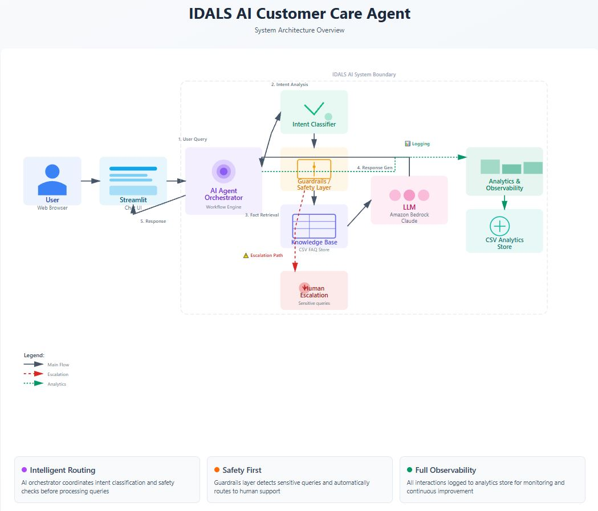
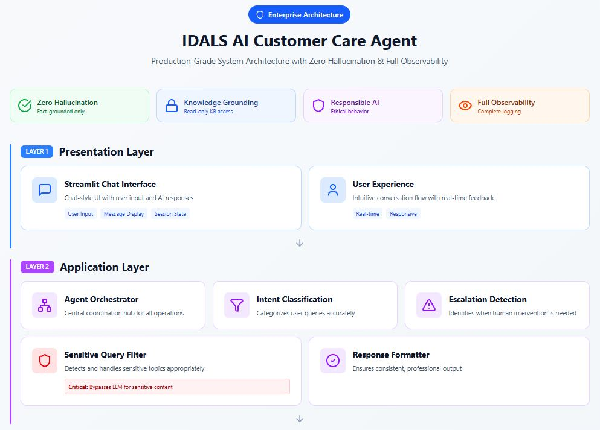
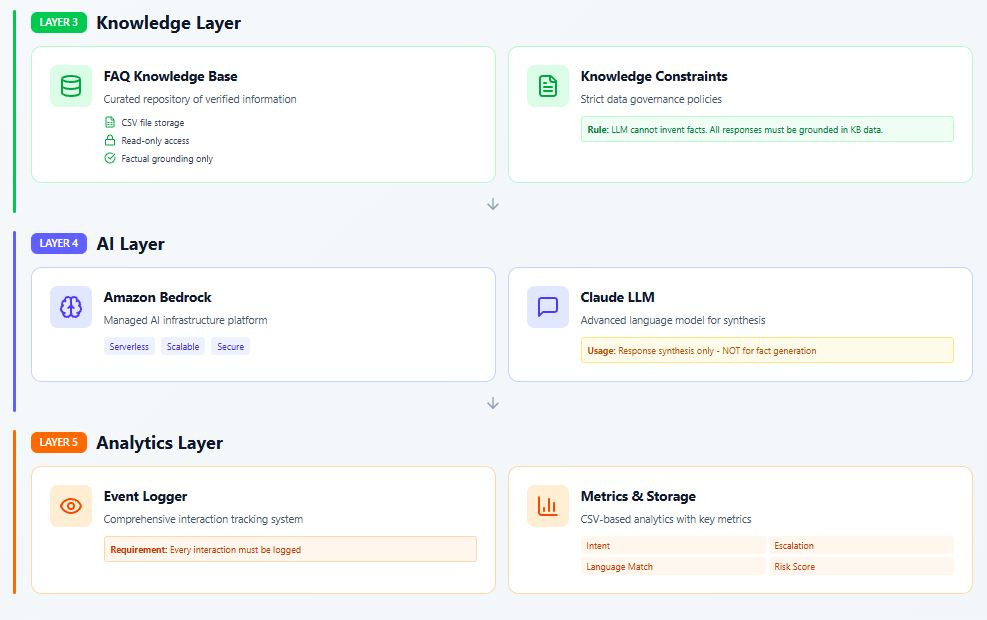
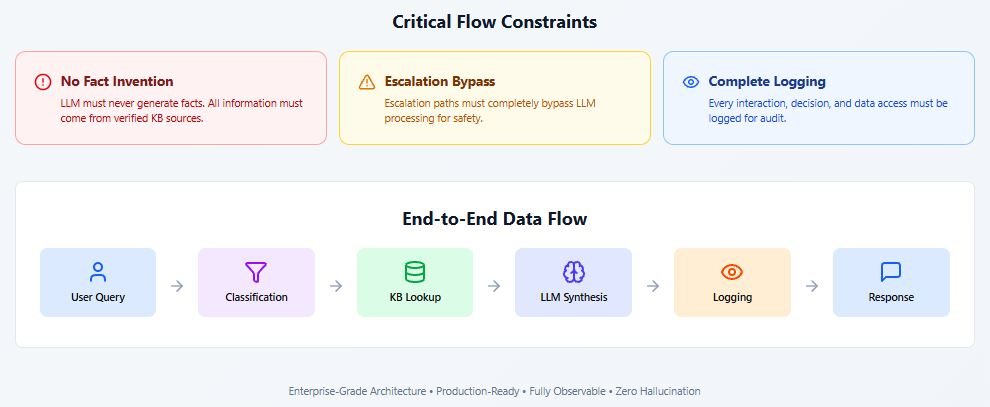
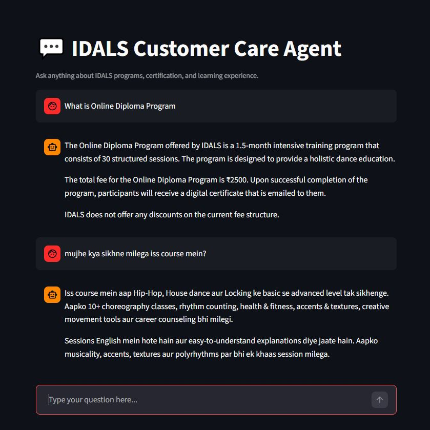

# IDALS Customer Care Agent

- Production-ready README and architecture diagram for the IDALS Customer Care Agent (Bedrock + AgentCore + WhatsApp + FastAPI + Streamlit analytics).

## Table of contents

1. Project overview
2. System architecture (diagram + description)
3. Components and responsibilities
4. Local development — quick start
5. Deployment & AWS setup (AgentCore, Lambda, API Gateway)
6. Environment variables & configuration
7. Analytics & observability
8. Testing checklist (manual + scripted)
9. Troubleshooting & common errors
10. Security & cost considerations
11. File structure
12. Next steps / roadmap

## 1. Project overview

**IDALS Customer Care Agent** is an information-first conversational assistant built to support an online dance diploma program. The assistant:

* Answers student FAQs grounded in a canonical CSV knowledge base (idals_qna.csv)
* Uses Amazon Bedrock + Bedrock AgentCore as the runtime for production LLM responses
* Supports channel integrations (WhatsApp via Twilio, HTTP via FastAPI)
* Tracks analytics (intent, escalation, hallucination risk) to `agent_analytics.csv`
* Provides a Streamlit UI for testing and an analytics dashboard for evaluation

Goals:

* Ground answers in FAQ; avoid hallucinations
* Provide escalation paths for sensitive queries (WhatsApp/email/human)
* Be deployable for demos and production (AgentCore runtime or FastAPI fallback)

## 2. System architecture

### High-Level System Architecture diagram 



### Production-Level Architecture





### ASCII fallback diagram

```
[User (WhatsApp / Web UI)]
          |           \
          |            \--> [FastAPI / Streamlit UI] --> [Local Agent (ChatBedrock)] --> [Bedrock]
          v
     [Twilio WhatsApp]
          v
     [Lambda Webhook] --> [AgentCore Invoke / HTTP] --> [Bedrock]
                                   |
                                   v
                                [FAISS]
                                   |
                                [Embeddings]
                                   |
                                [Analytics CSV] --> [Streamlit Dashboard]
```

**Notes:**

* Bedrock is used for both embeddings and LLM (ChatBedrock / BedrockEmbeddings).
* FAISS stores vectorized FAQ chunks created from `idals_qna.csv`.
* AgentCore is ideal for production (managed runtime, autoscaling, CloudWatch logs).

## 3. Components and responsibilities

* `idals_qna.csv` - canonical FAQ content (two columns: `question`, `answer`).
* `faq_loader.py` - CSV to Document loader (robust to encoding and missing headers).
* `vector_store.py` - builds FAISS from chunked FAQ documents and Bedrock embeddings.
* `tools.py` - tool wrappers (`search_faq`) used by the agent.
* `router.py` - intent classifier prompt that maps queries to intents.
* `agent.py` - core routing logic, escalation detection, final synthesis prompt.
* `agentcore_runtime.py` - Bedrock AgentCore entrypoint for production runtime.
* `lambda_function.py` - Twilio webhook -> sanitize sessionId -> invoke AgentCore or Agent HTTP endpoint.
* `whatsapp_sender.py` - helper for sending outbound WhatsApp messages through Twilio.
* `analytics.py` / `analytics_store.py` - append structured events to `agent_analytics.csv`.
* `ui.py` / `analytics_dashboard.py` - Streamlit-based test UI and analytics dashboard.
* `query_normalizer.py` - Cleans user input, handles spelling variations, normalized hinglish mixed language queries, improves intent classification accuracy.
* `language_normalizer.py` - Detects user language (English/Hinglish), ensures response language consistency, prevents language mismatch hallucinations.
* `escalation_detector.py` - Detects legal questions, job guarantees, refund amounts, government approval queries. Prevents unsafe or misleading responses.
* `escalation.py` - Centralized escalation responses. Ensures no policy violations, human handoff consistency, zero hallucination in sensitive cases.

## 4. Local development - quick start

### Prereqs

* Python 3.11
* Virtualenv (recommended)
* AWS CLI configured (profile with Bedrock / AgentCore permissions)
* (Optional) Twilio sandbox for WhatsApp testing

### Setup

```bash
python -m venv .venv
source .venv/bin/activate  # Windows: .\.venv\Scripts\activate
pip install -r requirements.txt
```

Make sure to set environment variables locally (use `.env` for development):

```
AWS_REGION=ap-south-1
GROQ_API_KEY=...         # only if using Groq for local model access
TWILIO_SID=...
TWILIO_AUTH_TOKEN=...
TWILIO_WHATSAPP_NUMBER=whatsapp:+1XXXXXXXXXX
AGENTCORE_ENDPOINT=https://<api-gateway-id>.execute-api.<region>.amazonaws.com/<stage>/runtimes/<runtime-id>/invoke
AGENTCORE_API_KEY=<optional> # if you enabled API key on the endpoint
```

### Run local FastAPI agent (development)

```bash
uvicorn app:app --reload
# test: curl -X POST http://127.0.0.1:8000/invoke -d '{"prompt":"Hello"}' -H 'Content-Type: application/json'
```

### Run Streamlit test UI + analytics

```bash
streamlit run ui.py
streamlit run analytics_dashboard.py  # analytics UI
```


## 5. Deployment & AWS setup

**AgentCore (recommended production path)**

1. `agentcore create` — create project
2. `agentcore deploy` — packages and deploys runtime to Bedrock AgentCore
3. `agentcore launch` — start a runtime session (use `-env VAR=VALUE` for secrets if needed)
4. `agentcore invoke` or configure API Gateway to forward webhooks to AgentCore

**Lambda + API Gateway (WhatsApp path)**

* Lambda webhook receives Twilio POST and invokes AgentCore (or local HTTP endpoint) using requests or boto3 `invoke_agent`.
* Make sure Lambda has necessary IAM permissions to call Bedrock/AgentCore.
* API Gateway stage URL is used as `AGENTCORE_ENDPOINT` when calling via HTTP from Lambda.

**Twilio Setup**

* Use Twilio sandbox / approved WhatsApp number.
* Configure webhook to point to your public endpoint (API Gateway -> Lambda) or ngrok during local testing.

### AgentCore (AWS Bedrock) Deployment

This agent was originally deployed using **Amazon Bedrock AgentCore**, enabling:

- Managed runtime execution
- Built-in observability & tracing
- Secure model access via IAM
- Session memory support (STM)

The AgentCore runtime was validated using real invocations during development.
Due to cold-start initialization limits (30s) with heavy LangChain dependencies,
the live AgentCore endpoint is not kept active for demo purposes.

The same agent logic is currently showcased via a FastAPI + Streamlit interface,
ensuring identical behavior and responses.

## 6. Environment variables & configuration

List of variables used across repository:

* `AWS_REGION` — e.g., `ap-south-1`
* `AWS_ACCESS_KEY_ID`, `AWS_SECRET_ACCESS_KEY` — if relying on env creds locally
* `GROQ_API_KEY` — if using Groq client in local dev
* `TWILIO_SID`, `TWILIO_AUTH_TOKEN`, `TWILIO_WHATSAPP_NUMBER`
* `AGENTCORE_ENDPOINT` — API Gateway or AgentCore HTTP endpoint (Lambda uses this to call agent)
* `AGENTCORE_API_KEY` — optional x-api-key header for gateway

**Where to set them**

* Locally: `.env` and `python-dotenv` (already used in code)
* AgentCore runtime: pass via `agentcore launch -env KEY="VALUE"` or update `.bedrock_agentcore.yaml` `env` section
* Lambda: set under Function Configuration -> Environment variables

## 7. Analytics & observability

* **CloudWatch**: AgentCore runtime logs and traces. Use `aws logs tail /aws/bedrock-agentcore/runtimes/<runtime>-DEFAULT --follow` to stream logs.
* **agent_analytics.csv**: local tracked events (timestamp, question, intent, escalation, language, hallucination_risk, response_length, output)
* **Streamlit dashboard**: `analytics_dashboard.py` to compute accuracy, confusion matrix, filters.

Suggested events to log on each invocation:

```json
{
  "timestamp": "...",
  "question": "...",
  "intent": "PROGRAM_INFO",
  "output": "PROGRAM_INFO",
  "escalation": false,
  "language": "en",
  "hallucination_risk": "LOW",
  "response_length": 245
}
```

## 8. Testing checklist (manual + scripted)

**Manual**

* [ ] Local FastAPI invocation returns `Echo test OK` then real response
* [ ] Streamlit UI sends question -> agent returns grounded answer
* [ ] WhatsApp flow: Twilio -> Lambda -> AgentCore -> reply back to user
* [ ] CloudWatch shows `IDALS_AGENT_ANALYTICS` events after each invocation

**Automated**

* `test_observability.py` — run a set of canonical questions and verify analytics CSV
* Unit tests for: `faq_loader`, `vector_store`, `router.classify_intent` (mock LLM), `response_formatter`.

## 9. Troubleshooting & common errors

* `Runtime initialization time exceeded (30s)` — ensure your runtime startup code is fast: avoid expensive work at import time (load vectorstore lazily or pre-build and store on S3).
* `NoCredentialsError: Unable to locate credentials` — configure `aws configure` or set `AWS_*` env vars.
* `ValidationException: provided model identifier is invalid` — confirm model id available in Bedrock; check region and model name.
* `Model use case details have not been submitted` — for Anthropic models, submit model use case in AWS console and wait ~15 minutes.
* `AgentId length/format` error when calling `invoke_agent` from Lambda — agentId must be the short id (alphanumeric, ≤10 chars) or use the runtime ARN depending on API. Use the format your SDK requires. (When in doubt, use AgentCore HTTP endpoint).
* `twilio` module missing in Lambda — package Twilio into a deployment package or use a Lambda layer with Twilio installed.

## 10. Security & cost considerations

* **Secrets**: Don’t hardcode API keys. Use Secrets Manager, Parameter Store or environment variables in AWS (Lambda/AgentCore env).
* **Least privilege**: Lambda role should have only necessary permissions.
* **Costs**: Bedrock and AgentCore can incur significant costs. Use smaller models during development and enable logging sampling.

## 11. File structure (recommended)

```
idals-customer-careagent/
├─ agentcore_runtime.py          # AgentCore runtime entrypoint
├─ agent.py                      # routing + synthesis logic
├─ tools.py                      # search_faq tool
├─ router.py                     # intent classifier prompt
├─ response_formatter.py         # polishing / localization helpers
├─ faq_loader.py                 # load idals_qna.csv
├─ vector_store.py               # build FAISS vector store
├─ analytics.py                  # log_event wrapper
├─ analytics_store.py            # CSV writer
├─ lambda_function.py            # Twilio webhook lambda (production)
├─ whatsapp_sender.py            # send outbound messages via Twilio
├─ ui.py                         # Streamlit testing UI
├─ analytics_dashboard.py        # Streamlit analytics dashboard
├─ requirements.txt
├─ query_normalizer.py
├─ language_normalizer.py
├─ escalation.py
├─ escalation_detector.py
└─ idals_qna.csv
```

## 12. Next steps / roadmap

* Harden runtime startup (prebuild FAISS and store on S3 to avoid 30s init limit).
* Add Redis or DynamoDB-backed memory for long-term memory mode.
* Replace Twilio sandbox with production WhatsApp Business API or Twilio number and add request validation.
* Add E2E tests for WhatsApp flow (simulate Twilio webhook + Lambda invocation).
* Add CI (GitHub Actions) to run tests and deploy to AgentCore.

## 13. Video Walkthrough

## 14. Author  
Shijin Ramesh  
[LinkedIn](https://www.linkedin.com/in/shijinramesh/) | [Portfolio](https://www.shijinramesh.co.in/)

## Appendix — quick reference commands

**Local**

```bash
python -m venv .venv
source .venv/bin/activate
pip install -r requirements.txt
uvicorn app:app --reload
streamlit run ui.py
streamlit run analytics_dashboard.py
```

**AgentCore (deploy)**

```bash
agentcore deploy
agentcore launch -env GROQ_API_KEY="..." -env OTHER=...  # runtime secrets
agentcore status
agentcore invoke '{"prompt": "Hello"}'
```

**Logs**

```bash
aws logs tail /aws/bedrock-agentcore/runtimes/<runtime>-DEFAULT --follow
```


